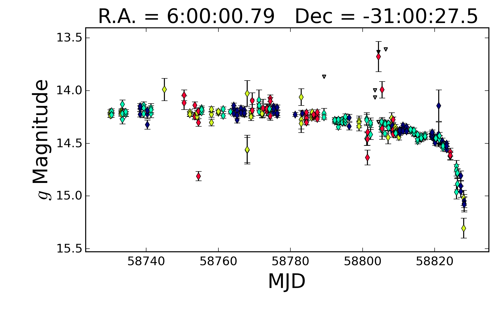

# asas-sn-J060000
Light curve analysis of the dimming star ASAS-SN-J060000.76-310027.83 as reported in [ATel #13346](http://www.astronomerstelegram.org/?read=13346) - see the Jupyter notebook with the analysis.

Data downloaded from the ASAS-SN web pages.

"ASAS-SN Discovery of an Unusual, Rapidly Fading Star"
Z. Way, K. Z. Stanek, C. S. Kochanek, T. Jayasinghe, P. Vallely, C. Basinger, T. A. Thompson (OSU), B. J. Shappee (Univ. of Hawaii), T. W.-S. Holoien (Carnegie Observatories), J. L. Prieto (Diego Portales; MAS), Subo Dong (KIAA-PKU), M. Stritzinger (Aarhus)

We assume a circular orbit for an opaque occulter with a knife edge transit to get an upper limit on the orbital distance and transverse velocity. The occulter can be gray and at a smaller orbital distance.

